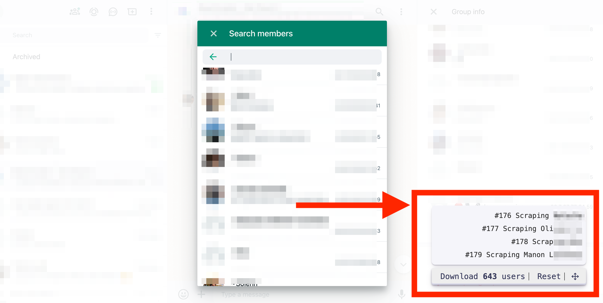
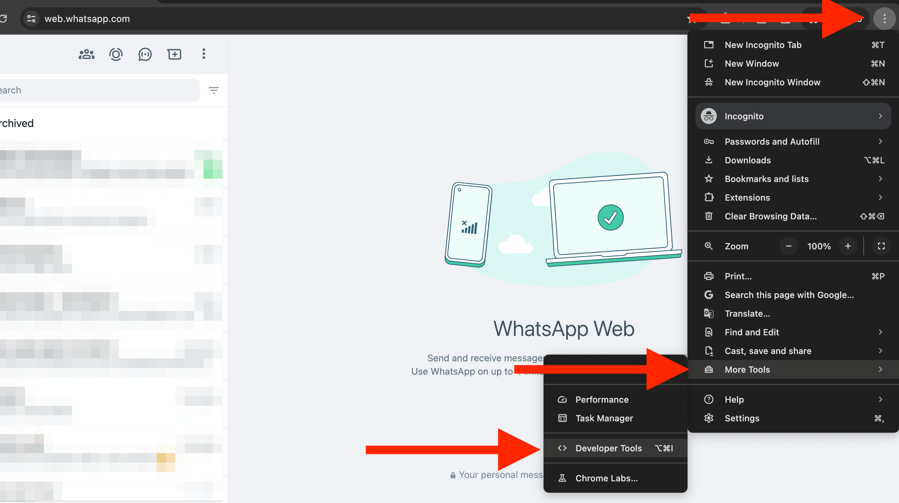
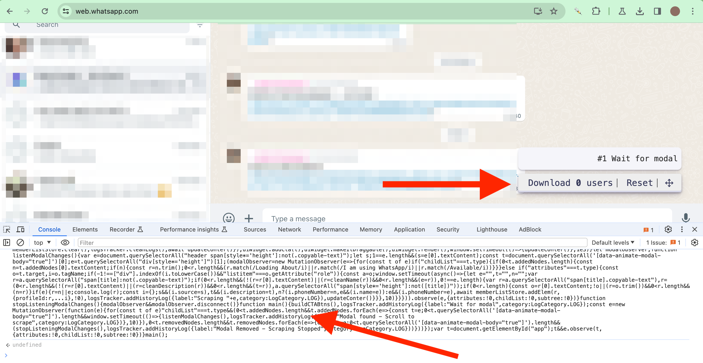
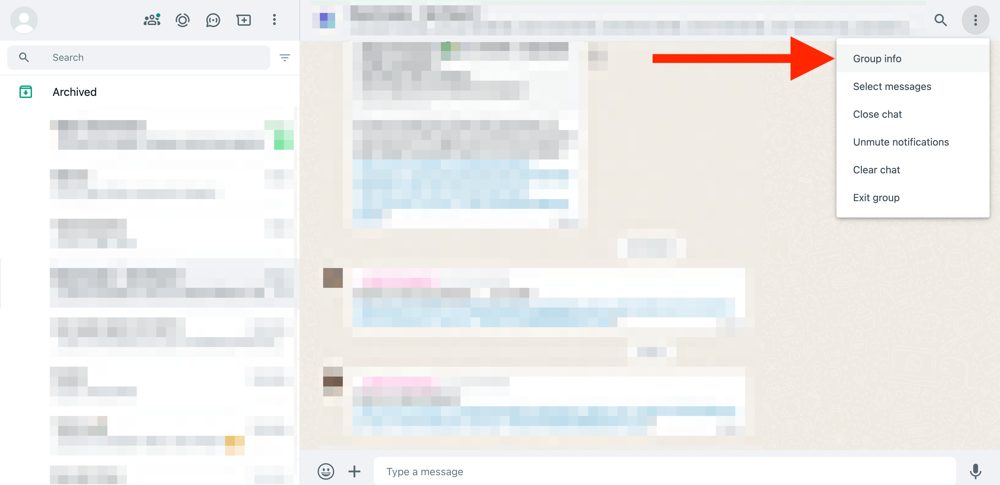
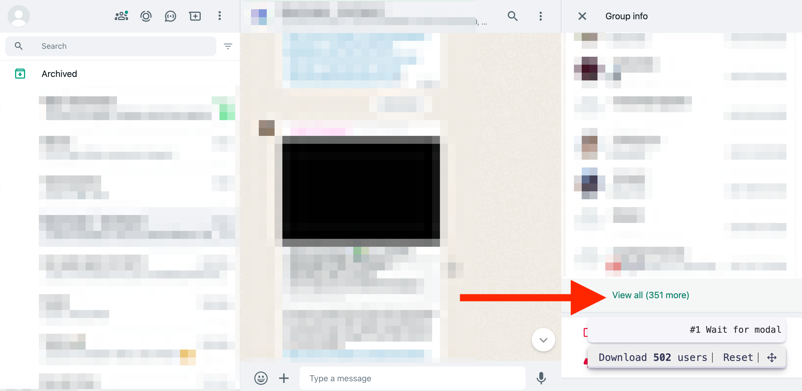
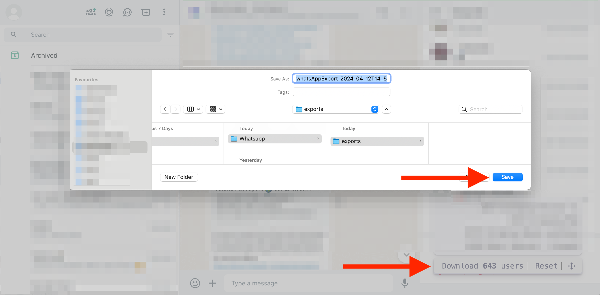

# WhatsApp Group Members Scraper

Script to scrape WhatsApp group members and export them into a CSV file. This WhatsApp members exporter works in the browser, without installing an extension or using a proxy. Open WhatsApp web client [https://web.whatsapp.com](https://web.whatsapp.com/), copy-paste the script into your Chrome console, and open the group members modal. Then scroll to scrape the member.



 Read our step-by-step [guide to scrape WhatsApp group members](https://www.datablist.com/how-to/scrape-whatsapp-group-members-free)

## How to run the WhatsApp Users Extractor script

 1. Open the [WhatsApp Web Client](https://web.whatsapp.com) on Chrome
 1. Open Chrome Developer Console
 1. Copy Paste the following code into the console. It will add a "Download 0 users" button. **Important: Copy/Paste before opening the group members modal**
 1. Click on "Group info" and "View all" in the members listing. It opens the group members modal.
 1. Scroll to load new users that will get scraped by the script. The button counter increases with new users scraped.
 1. Scroll several times between the top and the bottom.
 1. Once the counter stops increasing, click on the "Download X users" button to download the generated CSV file
 1. The profiles are kept in a cache until you click the "Reset" button. Thanks to this cache, the extracted profiles are still available if your browser "crashes".


## Scrapped Fields

- **Phone Number**: Member phone number 
- **Name**: Name shown on the modal. When available.
- **Description**: WhatsApp member description. When available.
- **Source**: Name of the WhatsApp group


The generated script is located in `dist/main.min.js`.

> [dist/main.min.js](dist/main.min.js)

```javascript
function exportToCsv(e,t){for(var n="",r=0;r<t.length;r++)n+=function(e){for(var t="",n=0;n<e.length;n++){var r=null===e[n]||void 0===e[n]?"":e[n].toString(),r=(r=e[n]instanceof Date?e[n].toLocaleString():r).replace(/"/g,'""');0<n&&(t+=","),t+=r=0<=r.search(/("|,|\n)/g)?'"'+r+'"':r}return t+"\n"}(t[r]);var o=new Blob([n],{type:"text/csv;charset=utf-8;"}),i=document.createElement("a");void 0!==i.download&&(o=URL.createObjectURL(o),i.setAttribute("href",o),i.setAttribute("download",e),document.body.appendChild(i),i.click(),document.body.removeChild(i))}const instanceOfAny=(t,e)=>e.some(e=>t instanceof e);let idbProxyableTypes,cursorAdvanceMethods;function getIdbProxyableTypes(){return idbProxyableTypes=idbProxyableTypes||[IDBDatabase,IDBObjectStore,IDBIndex,IDBCursor,IDBTransaction]}function getCursorAdvanceMethods(){return cursorAdvanceMethods=cursorAdvanceMethods||[IDBCursor.prototype.advance,IDBCursor.prototype.continue,IDBCursor.prototype.continuePrimaryKey]}const transactionDoneMap=new WeakMap,transformCache=new WeakMap,reverseTransformCache=new WeakMap;function promisifyRequest(i){var e=new Promise((e,t)=>{const n=()=>{i.removeEventListener("success",r),i.removeEventListener("error",o)},r=()=>{e(wrap(i.result)),n()},o=()=>{t(i.error),n()};i.addEventListener("success",r),i.addEventListener("error",o)});return reverseTransformCache.set(e,i),e}function cacheDonePromiseForTransaction(i){var e;transactionDoneMap.has(i)||(e=new Promise((e,t)=>{const n=()=>{i.removeEventListener("complete",r),i.removeEventListener("error",o),i.removeEventListener("abort",o)},r=()=>{e(),n()},o=()=>{t(i.error||new DOMException("AbortError","AbortError")),n()};i.addEventListener("complete",r),i.addEventListener("error",o),i.addEventListener("abort",o)}),transactionDoneMap.set(i,e))}let idbProxyTraps={get(e,t,n){if(e instanceof IDBTransaction){if("done"===t)return transactionDoneMap.get(e);if("store"===t)return n.objectStoreNames[1]?void 0:n.objectStore(n.objectStoreNames[0])}return wrap(e[t])},set(e,t,n){return e[t]=n,!0},has(e,t){return e instanceof IDBTransaction&&("done"===t||"store"===t)||t in e}};function replaceTraps(e){idbProxyTraps=e(idbProxyTraps)}function wrapFunction(t){return getCursorAdvanceMethods().includes(t)?function(...e){return t.apply(unwrap(this),e),wrap(this.request)}:function(...e){return wrap(t.apply(unwrap(this),e))}}function transformCachableValue(e){return"function"==typeof e?wrapFunction(e):(e instanceof IDBTransaction&&cacheDonePromiseForTransaction(e),instanceOfAny(e,getIdbProxyableTypes())?new Proxy(e,idbProxyTraps):e)}function wrap(e){if(e instanceof IDBRequest)return promisifyRequest(e);if(transformCache.has(e))return transformCache.get(e);var t=transformCachableValue(e);return t!==e&&(transformCache.set(e,t),reverseTransformCache.set(t,e)),t}const unwrap=e=>reverseTransformCache.get(e);function openDB(e,t,{blocked:n,upgrade:r,blocking:o,terminated:i}={}){const a=indexedDB.open(e,t),s=wrap(a);return r&&a.addEventListener("upgradeneeded",e=>{r(wrap(a.result),e.oldVersion,e.newVersion,wrap(a.transaction),e)}),n&&a.addEventListener("blocked",e=>n(e.oldVersion,e.newVersion,e)),s.then(e=>{i&&e.addEventListener("close",()=>i()),o&&e.addEventListener("versionchange",e=>o(e.oldVersion,e.newVersion,e))}).catch(()=>{}),s}const readMethods=["get","getKey","getAll","getAllKeys","count"],writeMethods=["put","add","delete","clear"],cachedMethods=new Map;function getMethod(e,t){if(e instanceof IDBDatabase&&!(t in e)&&"string"==typeof t){if(cachedMethods.get(t))return cachedMethods.get(t);const r=t.replace(/FromIndex$/,""),o=t!==r,i=writeMethods.includes(r);return r in(o?IDBIndex:IDBObjectStore).prototype&&(i||readMethods.includes(r))?(e=async function(e,...t){e=this.transaction(e,i?"readwrite":"readonly");let n=e.store;return o&&(n=n.index(t.shift())),(await Promise.all([n[r](...t),i&&e.done]))[0]},cachedMethods.set(t,e),e):void 0}}replaceTraps(r=>({...r,get:(e,t,n)=>getMethod(e,t)||r.get(e,t,n),has:(e,t)=>!!getMethod(e,t)||r.has(e,t)}));const advanceMethodProps=["continue","continuePrimaryKey","advance"],methodMap={},advanceResults=new WeakMap,ittrProxiedCursorToOriginalProxy=new WeakMap,cursorIteratorTraps={get(e,t){if(!advanceMethodProps.includes(t))return e[t];let n=methodMap[t];return n=n||(methodMap[t]=function(...e){advanceResults.set(this,ittrProxiedCursorToOriginalProxy.get(this)[t](...e))})}};async function*iterate(...e){let t=this;if(t=t instanceof IDBCursor?t:await t.openCursor(...e)){t=t;var n=new Proxy(t,cursorIteratorTraps);for(ittrProxiedCursorToOriginalProxy.set(n,t),reverseTransformCache.set(n,unwrap(t));t;)yield n,t=await(advanceResults.get(n)||t.continue()),advanceResults.delete(n)}}function isIteratorProp(e,t){return t===Symbol.asyncIterator&&instanceOfAny(e,[IDBIndex,IDBObjectStore,IDBCursor])||"iterate"===t&&instanceOfAny(e,[IDBIndex,IDBObjectStore])}replaceTraps(r=>({...r,get(e,t,n){return isIteratorProp(e,t)?iterate:r.get(e,t,n)},has(e,t){return isIteratorProp(e,t)||r.has(e,t)}}));var __awaiter$1=function(e,a,s,c){return new(s=s||Promise)(function(n,t){function r(e){try{i(c.next(e))}catch(e){t(e)}}function o(e){try{i(c.throw(e))}catch(e){t(e)}}function i(e){var t;e.done?n(e.value):((t=e.value)instanceof s?t:new s(function(e){e(t)})).then(r,o)}i((c=c.apply(e,a||[])).next())})},__rest=function(e,t){var n={};for(o in e)Object.prototype.hasOwnProperty.call(e,o)&&t.indexOf(o)<0&&(n[o]=e[o]);if(null!=e&&"function"==typeof Object.getOwnPropertySymbols)for(var r=0,o=Object.getOwnPropertySymbols(e);r<o.length;r++)t.indexOf(o[r])<0&&Object.prototype.propertyIsEnumerable.call(e,o[r])&&(n[o[r]]=e[o[r]]);return n};class ListStorage{constructor(e){this.name="scrape-storage",this.persistent=!0,this.data=new Map,null!=e&&e.name&&(this.name=e.name),null!=e&&e.persistent&&(this.persistent=e.persistent),this.initDB().then(()=>{}).catch(()=>{this.persistent=!1})}get storageKey(){return"storage-"+this.name}initDB(){return __awaiter$1(this,void 0,void 0,function*(){this.db=yield openDB(this.storageKey,6,{upgrade(e,t,n,r){let o;if(t<5)try{e.deleteObjectStore("data")}catch(e){}(o=e.objectStoreNames.contains("data")?r.objectStore("data"):e.createObjectStore("data",{keyPath:"_id",autoIncrement:!0}))&&!o.indexNames.contains("_createdAt")&&o.createIndex("_createdAt","_createdAt"),o&&!o.indexNames.contains("_groupId")&&o.createIndex("_groupId","_groupId"),o&&!o.indexNames.contains("_pk")&&o.createIndex("_pk","_pk",{unique:!0})}})})}_dbGetElem(t,n){return __awaiter$1(this,void 0,void 0,function*(){if(this.persistent&&this.db){const e=(n=n||this.db.transaction("data","readonly")).store;return yield e.index("_pk").get(t)}throw new Error("DB doesnt exist")})}getElem(e){return __awaiter$1(this,void 0,void 0,function*(){if(this.persistent&&this.db)try{return yield this._dbGetElem(e)}catch(e){console.error(e)}else this.data.get(e)})}_dbSetElem(o,i,a=!1,s,c){return __awaiter$1(this,void 0,void 0,function*(){if(this.persistent&&this.db){let e=!1;const n=(c=c||this.db.transaction("data","readwrite")).store;var t=yield n.index("_pk").get(o);if(t)a&&(yield n.put(Object.assign(Object.assign({},t),i)),e=!0);else{const r=Object.assign({_pk:o,_createdAt:new Date},i);s&&(r._groupId=s),yield n.put(r),e=!0}return e}throw new Error("DB doesnt exist")})}addElem(e,t,n=!1,r){return __awaiter$1(this,void 0,void 0,function*(){if(this.persistent&&this.db)try{return yield this._dbSetElem(e,t,n,r)}catch(e){console.error(e)}else this.data.set(e,t);return!0})}addElems(t,i=!1,a){return __awaiter$1(this,void 0,void 0,function*(){if(this.persistent&&this.db){const n=[],r=this.db.transaction("data","readwrite"),o=[];if(t.forEach(([e,t])=>{-1===o.indexOf(e)&&(o.push(e),n.push(this._dbSetElem(e,t,i,a,r)))}),0<n.length){n.push(r.done);const e=yield Promise.all(n);let t=0;return e.forEach(e=>{"boolean"==typeof e&&e&&(t+=1)}),t}return 0}return t.forEach(([e,t])=>{this.addElem(e,t)}),t.length})}deleteFromGroupId(r){return __awaiter$1(this,void 0,void 0,function*(){if(this.persistent&&this.db){let e=0;const n=this.db.transaction("data","readwrite");let t=yield n.store.index("_groupId").openCursor(IDBKeyRange.only(r));for(;t;)t.delete(),t=yield t.continue(),e+=1;return e}throw new Error("Not Implemented Error")})}clear(){return __awaiter$1(this,void 0,void 0,function*(){this.persistent&&this.db?yield this.db.clear("data"):this.data.clear()})}getCount(){return __awaiter$1(this,void 0,void 0,function*(){return this.persistent&&this.db?yield this.db.count("data"):this.data.size})}getAll(){return __awaiter$1(this,void 0,void 0,function*(){if(this.persistent&&this.db){const n=new Map,e=yield this.db.getAll("data");return e&&e.forEach(e=>{var t=e["_id"],e=__rest(e,["_id"]);n.set(t,e)}),n}return this.data})}toCsvData(){return __awaiter$1(this,void 0,void 0,function*(){const t=[],e=(t.push(this.headers),yield this.getAll());return e.forEach(e=>{try{t.push(this.itemToRow(e))}catch(e){console.error(e)}}),t})}}const btnStyles=["display: block;","padding: 0px 4px;","cursor: pointer;","text-align: center;"];function createCta(e){const t=document.createElement("div"),n=[...btnStyles];return e&&n.push("flex-grow: 1;"),t.setAttribute("style",n.join("")),t}const spacerStyles=["margin-left: 4px;","margin-right: 4px;","border-left: 1px solid #2e2e2e;"];function createSpacer(){const e=document.createElement("div");return e.innerHTML="&nbsp;",e.setAttribute("style",spacerStyles.join("")),e}function createTextSpan(e,t){var n,t=t||{};let r;const o=document.createElement("span");return(r=t.bold?(n=document.createElement("strong"),o.append(n),n):o).textContent=e,t.idAttribute&&r.setAttribute("id",t.idAttribute),o}const canvasStyles=["position: fixed;","top: 0;","left: 0;","z-index: 10000;","width: 100%;","height: 100%;","pointer-events: none;"],innerStyles=["position: absolute;","bottom: 30px;","right: 30px;","width: auto;","pointer-events: auto;"],ctaContainerStyles=["align-items: center;","appearance: none;","background-color: #EEE;","border-radius: 4px;","border-width: 0;","box-shadow: rgba(45, 35, 66, 0.4) 0 2px 4px,rgba(45, 35, 66, 0.3) 0 7px 13px -3px,#D6D6E7 0 -3px 0 inset;","box-sizing: border-box;","color: #36395A;","display: flex;","font-family: monospace;","height: 38px;","justify-content: space-between;","line-height: 1;","list-style: none;","overflow: hidden;","padding-left: 16px;","padding-right: 16px;","position: relative;","text-align: left;","text-decoration: none;","user-select: none;","white-space: nowrap;","font-size: 18px;"];class UIContainer{constructor(){this.ctas=[],this.canva=document.createElement("div"),this.canva.setAttribute("style",canvasStyles.join("")),this.inner=document.createElement("div"),this.inner.setAttribute("style",innerStyles.join("")),this.canva.appendChild(this.inner),this.history=document.createElement("div"),this.inner.appendChild(this.history),this.container=document.createElement("div"),this.container.setAttribute("style",ctaContainerStyles.join("")),this.inner.appendChild(this.container)}makeItDraggable(){let t=0,n=0,r=0,o=0;const i=e=>{r=e.clientX-t,o=e.clientY-n,this.inner.style.right=window.innerWidth-r-this.inner.offsetWidth+"px",this.inner.style.bottom=window.innerHeight-o-this.inner.offsetHeight+"px"};this.inner.addEventListener("mousedown",e=>{e.preventDefault(),t=e.clientX-this.inner.offsetLeft,n=e.clientY-this.inner.offsetTop,window.addEventListener("mousemove",i,!1)},!1),window.addEventListener("mouseup",()=>{window.removeEventListener("mousemove",i,!1)},!1);const e=document.createElement("div");e.style.cursor="move",e.innerHTML='<svg stroke="currentColor" fill="none" stroke-width="2" viewBox="0 0 24 24" stroke-linecap="round" stroke-linejoin="round" height="18px" width="18px" xmlns="http://www.w3.org/2000/svg"><polyline points="5 9 2 12 5 15"></polyline><polyline points="9 5 12 2 15 5"></polyline><polyline points="15 19 12 22 9 19"></polyline><polyline points="19 9 22 12 19 15"></polyline><line x1="2" y1="12" x2="22" y2="12"></line><line x1="12" y1="2" x2="12" y2="22"></line></svg>',this.addCta(createSpacer()),this.addCta(e)}render(){document.body.appendChild(this.canva)}addCta(e,t){void 0===t?this.ctas.push(e):this.ctas.splice(t,0,e),this.container.innerHTML="",this.ctas.forEach(e=>{this.container.appendChild(e)})}}var LogCategory,__awaiter=function(e,a,s,c){return new(s=s||Promise)(function(n,t){function r(e){try{i(c.next(e))}catch(e){t(e)}}function o(e){try{i(c.throw(e))}catch(e){t(e)}}function i(e){var t;e.done?n(e.value):((t=e.value)instanceof s?t:new s(function(e){e(t)})).then(r,o)}i((c=c.apply(e,a||[])).next())})};!function(e){e.ADD="add",e.LOG="log"}(LogCategory=LogCategory||{});const historyPanelStyles=["text-align: right;","background: #f5f5fa;","padding: 8px;","margin-bottom: 8px;","border-radius: 8px;","font-family: monospace;","font-size: 16px;","box-shadow: rgba(42, 35, 66, 0.2) 0 2px 2px,rgba(45, 35, 66, 0.2) 0 7px 13px -4px;","color: #2f2f2f;"],historyUlStyles=["list-style: none;","margin: 0;"],historyLiStyles=["line-height: 30px;","display: flex;","align-items: center;","justify-content: right;"],deleteIconStyles=["display: flex;","align-items: center;","padding: 4px 12px;","cursor: pointer;"],deleteIconSvg='<svg stroke="currentColor" fill="none" stroke-width="2" viewBox="0 0 24 24" stroke-linecap="round" stroke-linejoin="round" height="16px" width="16px" xmlns="http://www.w3.org/2000/svg"><polyline points="3 6 5 6 21 6"></polyline><path d="M19 6v14a2 2 0 0 1-2 2H7a2 2 0 0 1-2-2V6m3 0V4a2 2 0 0 1 2-2h4a2 2 0 0 1 2 2v2"></path></svg>';class HistoryTracker{constructor({onDelete:e,divContainer:t,maxLogs:n}){this.maxLogs=5,this.logs=[],this.panelRef=null,this.counter=0,this.onDelete=e,this.container=t,n&&(this.maxLogs=n)}renderPanel(){const e=document.createElement("div");return e.setAttribute("style",historyPanelStyles.join("")),e}renderLogs(){if(this.panelRef&&this.panelRef.remove(),0!==this.logs.length){const o=document.createElement("ul"),e=(o.setAttribute("style",historyUlStyles.join("")),this.logs.forEach(t=>{const e=document.createElement("li");e.setAttribute("style",historyLiStyles.join(""));let n;if(n=t.category===LogCategory.ADD?`<div>#${t.index} ${t.label} (${t.numberItems})</div>`:`<div>#${t.index} ${t.label}</div>`,e.innerHTML=n,t.category===LogCategory.ADD&&t.cancellable){const r=document.createElement("div");r.setAttribute("style",deleteIconStyles.join("")),r.innerHTML=deleteIconSvg,r.addEventListener("click",()=>__awaiter(this,void 0,void 0,function*(){yield this.onDelete(t.groupId);var e=this.logs.findIndex(e=>e.index===t.index);-1!==e&&(this.logs.splice(e,1),this.renderLogs())})),e.append(r)}o.prepend(e)}),this.renderPanel());e.appendChild(o),this.panelRef=e,this.container.appendChild(e)}}addHistoryLog(e){this.counter+=1;let t;if(e.category===LogCategory.ADD)t={index:this.counter,label:e.label,groupId:e.groupId,numberItems:e.numberItems,cancellable:e.cancellable,createdAt:new Date,category:LogCategory.ADD};else{if(e.category!==LogCategory.LOG)return void console.error("Missing category");t={index:this.counter,label:e.label,createdAt:new Date,category:LogCategory.LOG}}this.logs.unshift(t),this.logs.length>this.maxLogs&&this.logs.splice(this.maxLogs),this.renderLogs()}cleanLogs(){this.logs=[],this.counter=0,this.renderLogs()}}function cleanName(e){const t=e.trim();return t.replace("~ ","")}function cleanDescription(e){const t=e.trim();return t.match(/Loading About/i)||t.match(/I am using WhatsApp/i)||t.match(/Available/i)?null:t}class WhatsAppStorage extends ListStorage{get headers(){return["Phone Number","Name","Description","Source"]}itemToRow(e){return[e.phoneNumber||"",e.name||"",e.description||"",e.source||""]}}const memberListStore=new WhatsAppStorage({name:"whatsapp-scraper"}),counterId="scraper-number-tracker",exportName="whatsAppExport";let logsTracker;async function updateConter(){const e=document.getElementById(counterId);if(e){const t=await memberListStore.getCount();e.textContent=t.toString()}}const uiWidget=new UIContainer;function buildCTABtns(){logsTracker=new HistoryTracker({onDelete:async e=>{console.log("Delete "+e),await memberListStore.deleteFromGroupId(e),await updateConter()},divContainer:uiWidget.history,maxLogs:4});const e=createCta(),t=(e.appendChild(createTextSpan("Download ")),e.appendChild(createTextSpan("0",{bold:!0,idAttribute:counterId})),e.appendChild(createTextSpan(" users")),e.addEventListener("click",async function(){var e=(new Date).toISOString(),t=await memberListStore.toCsvData();try{exportToCsv(exportName+`-${e}.csv`,t)}catch(e){console.error("Error while generating export"),console.log(e.stack)}}),uiWidget.addCta(e),uiWidget.addCta(createSpacer()),createCta());t.appendChild(createTextSpan("Reset")),t.addEventListener("click",async function(){await memberListStore.clear(),logsTracker.cleanLogs(),await updateConter()}),uiWidget.addCta(t),uiWidget.makeItDraggable(),uiWidget.render(),window.setTimeout(()=>{updateConter()},1e3)}let modalObserver;function listenModalChanges(){var e=document.querySelectorAll("header span[style*='height']:not(.copyable-text)");let s;1==e.length&&(s=e[0].textContent);const t=document.querySelectorAll('[data-animate-modal-body="true"]')[0];e=t.querySelectorAll("div[style*='height']")[1];(modalObserver=new MutationObserver(e=>{for(const t of e)if("childList"===t.type){if(0<t.addedNodes.length){const n=t.addedNodes[0].textContent;if(n){const r=n.trim();0<r.length&&(r.match(/Loading About/i)||r.match(/I am using WhatsApp/i)||r.match(/Available/i))}}}else if("attributes"===t.type){const o=t.target,i=o.tagName;if(-1!==["div"].indexOf(i.toLowerCase())&&"listitem"===o.getAttribute("role")){const a=o;window.setTimeout(async()=>{let e="",t="",n="";var r=a.querySelectorAll("span[title]:not(.copyable-text)");if(0<r.length&&(!(r=r[0].textContent)||(r=cleanName(r))&&0<r.length&&(e=r)),0!==e.length){var r=a.querySelectorAll("span[title].copyable-text"),r=(0<r.length&&(!(r=r[0].textContent)||(r=cleanDescription(r))&&0<r.length&&(t=r)),a.querySelectorAll("span[style*='height']:not([title])"));if(0<r.length){const o=r[0].textContent;!o||(r=o.trim())&&0<r.length&&(n=r)}if(e){r=n||e;console.log(r);const i={};s&&(i.source=s),t&&(i.description=t),n?(i.phoneNumber=n,e&&(i.name=e)):e&&(i.phoneNumber=e),await memberListStore.addElem(r,{profileId:r,...i},!0),logsTracker.addHistoryLog({label:"Scraping "+e,category:LogCategory.LOG}),updateConter()}}},10)}}})).observe(e,{attributes:!0,childList:!0,subtree:!0})}function stopListeningModalChanges(){modalObserver&&modalObserver.disconnect()}function main(){buildCTABtns(),logsTracker.addHistoryLog({label:"Wait for modal",category:LogCategory.LOG});const e=new MutationObserver(function(e){for(const t of e)"childList"===t.type&&(0<t.addedNodes.length&&t.addedNodes.forEach(e=>{const t=e;0<t.querySelectorAll('[data-animate-modal-body="true"]').length&&window.setTimeout(()=>{listenModalChanges(),logsTracker.addHistoryLog({label:"Modal found - Scroll to scrape",category:LogCategory.LOG})},10)}),0<t.removedNodes.length&&t.removedNodes.forEach(e=>{const t=e;0<t.querySelectorAll('[data-animate-modal-body="true"]').length&&(stopListeningModalChanges(),logsTracker.addHistoryLog({label:"Modal Removed - Scraping Stopped",category:LogCategory.LOG}))}))});var t=document.getElementById("app");t&&e.observe(t,{attributes:!0,childList:!0,subtree:!0})}main();
```

## WhatsApp Member Extractor tutorial with screenshots

**Open Chrome Developer Console**

To open the Chrome Developer console on Chrome, use the keyboard shortcut `Ctrl + Shift + I` (on Windows) or `Cmd + Option + I` (on Mac).




**Copy Paste the script**

Select the "Console" tab and copy-paste the script from above. [Read the source code](src/main.ts) to understand what this script does.




**Open the WhatsApp Group Members Modal**

The script scrape the member information as they are displayed. The script scrapes directly the modal list elements.

Click on the "Group Info" link.



Then, open the Group Members modal.




**Scroll in the Group Members Modal**

**Then, scroll slowly to the bottom, then slowly back to the top.** The members information are loaded as you scroll and if you scroll too fast, the UI won't have the time to display it.

If the counter in the widget text increases as you navigate, it's working!

**Scroll while the counter number change.**


**Export users in CSV format**

Once finished, or to perform "export checkpoints", click the button "Download X users". A Download window will prompt asking where to save your CSV file.




**Edit and view your CSV file**

[To load and view the CSV file](https://www.datablist.com/csv-editor), use [Datablist.com](https://www.datablist.com/) or any spreadsheet tools.


## FAQ

- **How to remove the "Download" button?**
    - Just reload your WhatsApp page. Any javascript code added in Chrome Developer Console will be removed.
- **How many users can be extracted?**
    - The script stores the extracted users in a database. There is no limit on the number of users you can extract.
- **Can I extract users from different groups**
    - Yes. The exported CSV contains a "Source" attribute. You can extract users from different sources and use the "Source" attribute to segment your data later on.
- **What is the "Reset" button?**
    - The users are stored in a cache in your browser. The cache is kept if your browser restarts the page (intentionally or after a crash). When you copy/paste the script, it loads the previous profiles from the cache. The "Reset" button clears the cache.
- **Is it free?**
    - The script is free and open-source. You can also clean and parse the data with a free account on [Datablist](https://www.datablist.com).


## How to build it locally

```
yarn install
yarn build
```

## Other Scrapers & Guides

- [Scrape Instagram followers, following users, post authors](https://github.com/floriandiud/instagram-users-scraper). And the tutorial to use the [Instagram Scraper](https://www.datablist.com/how-to/scrape-instagram-users-free-followers-followings-authors).
- [Script to scrape Facebook group members and export them into a CSV file.](https://github.com/floriandiud/facebook-group-members-scraper). And the tutorial to [Scrape Facebook groups members and enrich them with LinkedIn profile and Email addresses.](https://www.datablist.com/how-to/scrape-facebook-group-members-linkedin)
- [Extract WhatsApp Group members](https://www.datablist.com/how-to/scrape-whatsapp-group-members-free)


