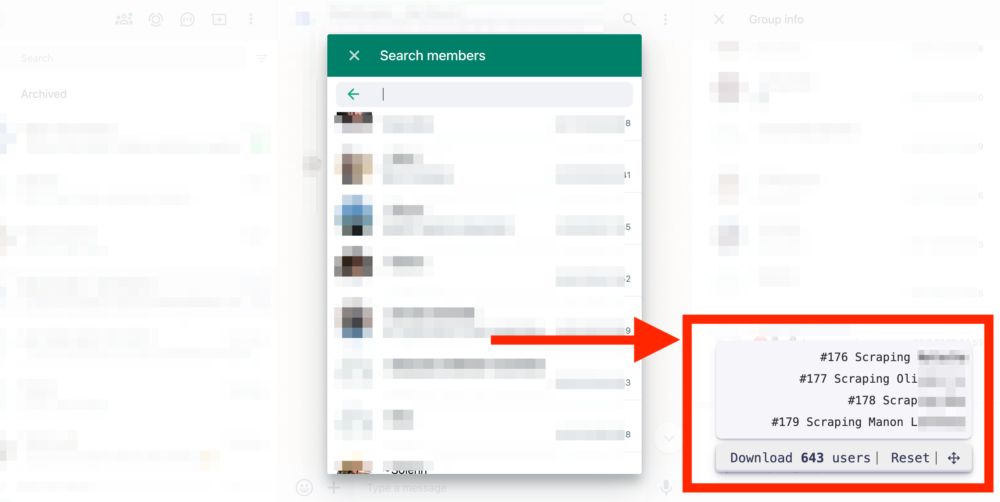
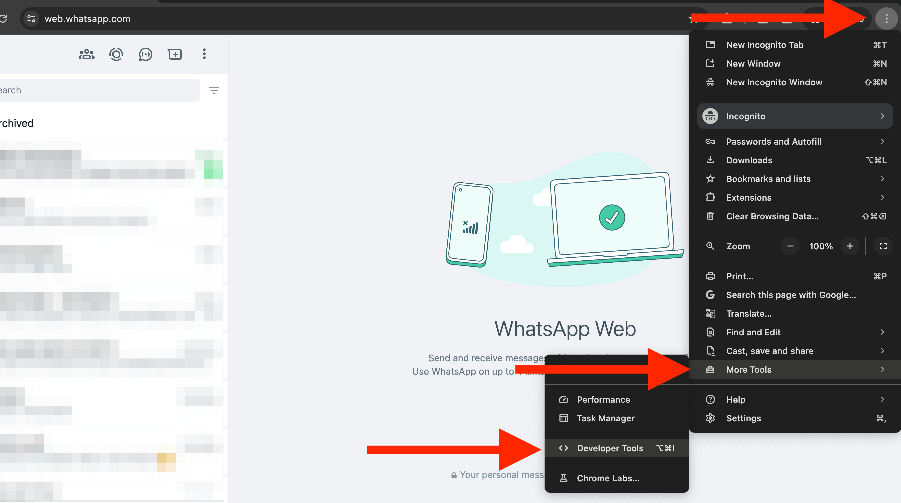
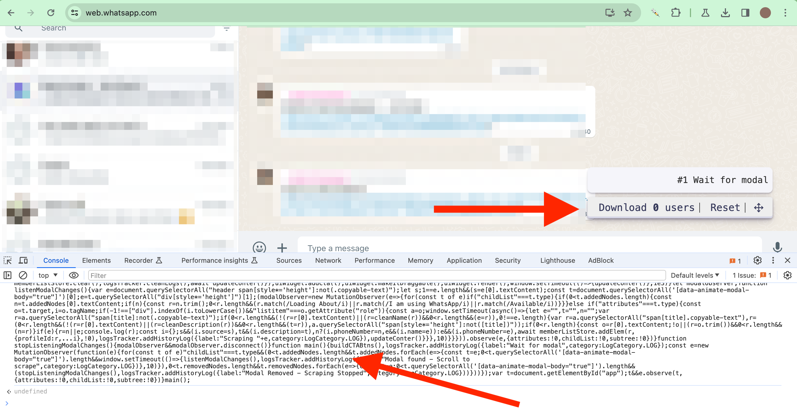
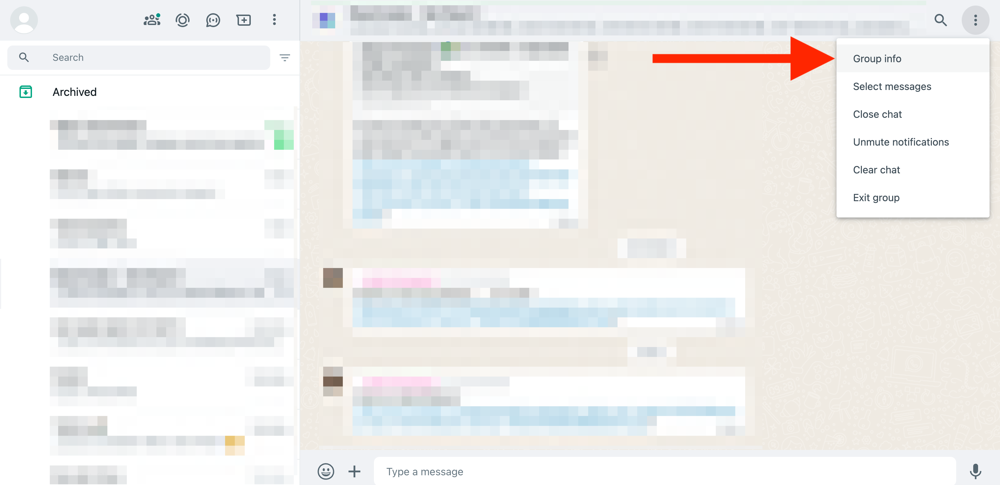
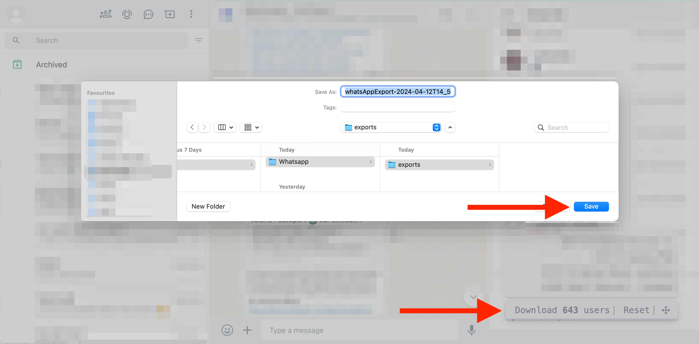

# WhatsApp Group Members Scraper

Script to export WhatsApp group members into a CSV file. It runs in the browser — no extension and no proxy. Open the [WhatsApp Web client](https://web.whatsapp.com/), copy-paste the script into your Chrome console, and click **Export**. The script reads WhatsApp Web's own IndexedDB (`model-storage`) and downloads every member in one shot. It does **not** scrape the DOM member modal, so you do not need to open "View all" or scroll the list.



 Read our step-by-step [guide to scrape WhatsApp group members](https://www.datablist.com/how-to/scrape-whatsapp-group-members-free)

## How to run the WhatsApp Users Extractor script

 1. Open [WhatsApp Web](https://web.whatsapp.com) on Chrome and open the group chat (Hebrew UI is fine). You do **not** need to open group info or the members modal.
 1. Open Chrome Developer Console
 1. Copy-paste the following code into the console. A small widget appears.
 1. Pick the group from the list, then Export. It reads IndexedDB and downloads a UTF-8 BOM CSV of **all** members. No scrolling.
 1. Some members only have a LID (`@lid`), not a phone — WhatsApp no longer gives the number unless they are a saved contact or have shared it. Those rows still export with name + id.


## Language support

- Works with WhatsApp Web in Hebrew and other languages, and with non-Latin names.
- Group matching uses the visible chat title (including Hebrew). Info modal is not required.
- CSV is UTF-8 with BOM (Excel-safe).
- This is an IndexedDB `model-storage` export, not DOM scraping.

## Exported Fields

- **Phone Number**: Digits from a `@c.us` id, or from the contact record when a `@lid` can be resolved. Empty when WhatsApp only stored a LID.
- **Name**: Contact name (or pushname / verified / short name).
- **Pushname**: WhatsApp push name, when stored.
- **Source**: Name of the WhatsApp group
- **Id**: WhatsApp id (`123@c.us` or `456@lid`)


The generated script is located in `dist/main.min.js`.

> [dist/main.min.js](dist/main.min.js)

```javascript
const instanceOfAny=(t,e)=>e.some(e=>t instanceof e);let idbProxyableTypes,cursorAdvanceMethods;function getIdbProxyableTypes(){return idbProxyableTypes=idbProxyableTypes||[IDBDatabase,IDBObjectStore,IDBIndex,IDBCursor,IDBTransaction]}function getCursorAdvanceMethods(){return cursorAdvanceMethods=cursorAdvanceMethods||[IDBCursor.prototype.advance,IDBCursor.prototype.continue,IDBCursor.prototype.continuePrimaryKey]}const transactionDoneMap=new WeakMap,transformCache=new WeakMap,reverseTransformCache=new WeakMap;function promisifyRequest(i){var e=new Promise((e,t)=>{const r=()=>{i.removeEventListener("success",n),i.removeEventListener("error",o)},n=()=>{e(wrap(i.result)),r()},o=()=>{t(i.error),r()};i.addEventListener("success",n),i.addEventListener("error",o)});return reverseTransformCache.set(e,i),e}function cacheDonePromiseForTransaction(i){var e;transactionDoneMap.has(i)||(e=new Promise((e,t)=>{const r=()=>{i.removeEventListener("complete",n),i.removeEventListener("error",o),i.removeEventListener("abort",o)},n=()=>{e(),r()},o=()=>{t(i.error||new DOMException("AbortError","AbortError")),r()};i.addEventListener("complete",n),i.addEventListener("error",o),i.addEventListener("abort",o)}),transactionDoneMap.set(i,e))}let idbProxyTraps={get(e,t,r){if(e instanceof IDBTransaction){if("done"===t)return transactionDoneMap.get(e);if("store"===t)return r.objectStoreNames[1]?void 0:r.objectStore(r.objectStoreNames[0])}return wrap(e[t])},set(e,t,r){return e[t]=r,!0},has(e,t){return e instanceof IDBTransaction&&("done"===t||"store"===t)||t in e}};function replaceTraps(e){idbProxyTraps=e(idbProxyTraps)}function wrapFunction(t){return getCursorAdvanceMethods().includes(t)?function(...e){return t.apply(unwrap(this),e),wrap(this.request)}:function(...e){return wrap(t.apply(unwrap(this),e))}}function transformCachableValue(e){return"function"==typeof e?wrapFunction(e):(e instanceof IDBTransaction&&cacheDonePromiseForTransaction(e),instanceOfAny(e,getIdbProxyableTypes())?new Proxy(e,idbProxyTraps):e)}function wrap(e){if(e instanceof IDBRequest)return promisifyRequest(e);if(transformCache.has(e))return transformCache.get(e);var t=transformCachableValue(e);return t!==e&&(transformCache.set(e,t),reverseTransformCache.set(t,e)),t}const unwrap=e=>reverseTransformCache.get(e),readMethods=["get","getKey","getAll","getAllKeys","count"],writeMethods=["put","add","delete","clear"],cachedMethods=new Map;function getMethod(e,t){if(e instanceof IDBDatabase&&!(t in e)&&"string"==typeof t){if(cachedMethods.get(t))return cachedMethods.get(t);const n=t.replace(/FromIndex$/,""),o=t!==n,i=writeMethods.includes(n);return n in(o?IDBIndex:IDBObjectStore).prototype&&(i||readMethods.includes(n))?(e=async function(e,...t){e=this.transaction(e,i?"readwrite":"readonly");let r=e.store;return o&&(r=r.index(t.shift())),(await Promise.all([r[n](...t),i&&e.done]))[0]},cachedMethods.set(t,e),e):void 0}}replaceTraps(n=>({...n,get:(e,t,r)=>getMethod(e,t)||n.get(e,t,r),has:(e,t)=>!!getMethod(e,t)||n.has(e,t)}));const advanceMethodProps=["continue","continuePrimaryKey","advance"],methodMap={},advanceResults=new WeakMap,ittrProxiedCursorToOriginalProxy=new WeakMap,cursorIteratorTraps={get(e,t){if(!advanceMethodProps.includes(t))return e[t];let r=methodMap[t];return r=r||(methodMap[t]=function(...e){advanceResults.set(this,ittrProxiedCursorToOriginalProxy.get(this)[t](...e))})}};async function*iterate(...e){let t=this;if(t=t instanceof IDBCursor?t:await t.openCursor(...e)){t=t;var r=new Proxy(t,cursorIteratorTraps);for(ittrProxiedCursorToOriginalProxy.set(r,t),reverseTransformCache.set(r,unwrap(t));t;)yield r,t=await(advanceResults.get(r)||t.continue()),advanceResults.delete(r)}}function isIteratorProp(e,t){return t===Symbol.asyncIterator&&instanceOfAny(e,[IDBIndex,IDBObjectStore,IDBCursor])||"iterate"===t&&instanceOfAny(e,[IDBIndex,IDBObjectStore])}replaceTraps(n=>({...n,get(e,t,r){return isIteratorProp(e,t)?iterate:n.get(e,t,r)},has(e,t){return isIteratorProp(e,t)||n.has(e,t)}}));const btnStyles=["display: block;","padding: 0px 4px;","cursor: pointer;","text-align: center;"];function createCta(e){const t=document.createElement("div"),r=[...btnStyles];return e&&r.push("flex-grow: 1;"),t.setAttribute("style",r.join("")),t}const spacerStyles=["margin-left: 4px;","margin-right: 4px;","border-left: 1px solid #2e2e2e;"];function createSpacer(){const e=document.createElement("div");return e.innerHTML="&nbsp;",e.setAttribute("style",spacerStyles.join("")),e}function createTextSpan(e,t){var r,t=t||{};let n;const o=document.createElement("span");return(n=t.bold?(r=document.createElement("strong"),o.append(r),r):o).textContent=e,t.idAttribute&&n.setAttribute("id",t.idAttribute),o}const canvasStyles=["position: fixed;","top: 0;","left: 0;","z-index: 10000;","width: 100%;","height: 100%;","pointer-events: none;"],innerStyles=["position: absolute;","bottom: 30px;","right: 30px;","width: auto;","pointer-events: auto;"],ctaContainerStyles=["align-items: center;","appearance: none;","background-color: #EEE;","border-radius: 4px;","border-width: 0;","box-shadow: rgba(45, 35, 66, 0.4) 0 2px 4px,rgba(45, 35, 66, 0.3) 0 7px 13px -3px,#D6D6E7 0 -3px 0 inset;","box-sizing: border-box;","color: #36395A;","display: flex;","font-family: monospace;","height: 38px;","justify-content: space-between;","line-height: 1;","list-style: none;","overflow: hidden;","padding-left: 16px;","padding-right: 16px;","position: relative;","text-align: left;","text-decoration: none;","user-select: none;","white-space: nowrap;","font-size: 18px;"];class UIContainer{constructor(){this.ctas=[],this.canva=document.createElement("div"),this.canva.setAttribute("style",canvasStyles.join("")),this.inner=document.createElement("div"),this.inner.setAttribute("style",innerStyles.join("")),this.canva.appendChild(this.inner),this.history=document.createElement("div"),this.inner.appendChild(this.history),this.container=document.createElement("div"),this.container.setAttribute("style",ctaContainerStyles.join("")),this.inner.appendChild(this.container)}makeItDraggable(){let t=0,r=0,n=0,o=0;const i=e=>{n=e.clientX-t,o=e.clientY-r,this.inner.style.right=window.innerWidth-n-this.inner.offsetWidth+"px",this.inner.style.bottom=window.innerHeight-o-this.inner.offsetHeight+"px"};this.inner.addEventListener("mousedown",e=>{e.preventDefault(),t=e.clientX-this.inner.offsetLeft,r=e.clientY-this.inner.offsetTop,window.addEventListener("mousemove",i,!1)},!1),window.addEventListener("mouseup",()=>{window.removeEventListener("mousemove",i,!1)},!1);const e=document.createElement("div");e.style.cursor="move",e.innerHTML='<svg stroke="currentColor" fill="none" stroke-width="2" viewBox="0 0 24 24" stroke-linecap="round" stroke-linejoin="round" height="18px" width="18px" xmlns="http://www.w3.org/2000/svg"><polyline points="5 9 2 12 5 15"></polyline><polyline points="9 5 12 2 15 5"></polyline><polyline points="15 19 12 22 9 19"></polyline><polyline points="19 9 22 12 19 15"></polyline><line x1="2" y1="12" x2="22" y2="12"></line><line x1="12" y1="2" x2="12" y2="22"></line></svg>',this.addCta(createSpacer()),this.addCta(e)}render(){document.body.appendChild(this.canva)}addCta(e,t){void 0===t?this.ctas.push(e):this.ctas.splice(t,0,e),this.container.innerHTML="",this.ctas.forEach(e=>{this.container.appendChild(e)})}}var LogCategory;!function(e){e.ADD="add",e.LOG="log"}(LogCategory=LogCategory||{});const DB_NAME="model-storage",DEFAULT_STATUS="Choose a group, then Export",EXPORT_PREFIX="whatsAppExport",PREFERRED_GROUP_HINT="חסד בישראל",PREFERRED_GROUP_TITLE="חסד בישראל - עזרה רפואית",DASH_CHARS=/[-\u2013\u2014\u05be]/g,BIDI_MARKS=/[\u200e\u200f\u202a-\u202e\u2066-\u2069]/g,BIDI_AND_SPACE=/[\s\-\(\)\.\u00a0\u202f\u200e\u200f\u202a-\u202e\u2066-\u2069]/g,CHAT_STORE_CANDIDATES=["chat","chats"],PARTICIPANT_STORE_CANDIDATES=["participant","participants"],CONTACT_STORE_CANDIDATES=["contact","contacts"],GROUP_META_STORE_CANDIDATES=["group-metadata","groupMetadata","group_metadata","group-meta"];function stripBidi(e){return e.replace(BIDI_MARKS,"")}function normalizeText(e){return stripBidi(e).replace(/\s+/g," ").trim()}function normalizeDashes(e){return e.replace(DASH_CHARS,"-")}function matchKey(e){return normalizeDashes(normalizeText(e)).toLowerCase()}function isPhoneNumber(e){e=e.replace(BIDI_AND_SPACE,"");return/^\+?\d{6,15}$/.test(e)}function asRecord(e){return!e||"object"!=typeof e||Array.isArray(e)?null:e}function asArray(e){if(Array.isArray(e))return e;e=asRecord(e);return e?Array.isArray(e._models)?e._models:Array.isArray(e.models)?e.models:Array.isArray(e.toArray)?e.toArray:[]:[]}function serializeId(e){if(null==e)return"";if("string"==typeof e||"number"==typeof e)return String(e);e=asRecord(e);return e?"string"==typeof e._serialized?e._serialized:"string"==typeof e.id?e.id:null!=e.user&&null!=e.server?e.user+"@"+e.server:"string"==typeof e.wid?e.wid:e.wid?serializeId(e.wid):"":""}function userPart(e){const t=normalizeText(e);e=t.indexOf("@");return 0<=e?t.slice(0,e):t}function serverPart(e){const t=normalizeText(e);e=t.indexOf("@");return 0<=e?t.slice(e+1):""}function idsEqual(e,t){e=normalizeText(e),t=normalizeText(t);if(!e||!t)return!1;if(e===t)return!0;var r=userPart(e),n=userPart(t),e=serverPart(e),t=serverPart(t);return!!r&&r===n&&!!e&&e===t}function pickStoreName(e,t){const r=Array.from(e.objectStoreNames);for(const i of t)if(r.includes(i))return i;const n=r.map(e=>e.toLowerCase());for(const a of t){const s=a.toLowerCase();var o=n.indexOf(s);if(0<=o)return r[o];o=n.findIndex(e=>e.includes(s)||s.includes(e));if(0<=o)return r[o]}return null}function openModelStorage(){return new Promise((e,r)=>{let n;try{n=indexedDB.open(DB_NAME)}catch(e){return void r(e)}n.onerror=()=>{r(n.error||new Error("Failed to open IndexedDB model-storage"))},n.onsuccess=()=>e(n.result),n.onupgradeneeded=e=>{var t;if(0===e.oldVersion){try{null!=(t=n.transaction)&&t.abort()}catch{}r(new Error("WhatsApp model-storage is missing. Open https://web.whatsapp.com first."))}}})}function getAllFromStore(o,i){return new Promise((e,t)=>{try{const r=o.transaction(i,"readonly"),n=r.objectStore(i).getAll();n.onsuccess=()=>e(n.result||[]),n.onerror=()=>t(n.error||new Error("Failed to read store "+i))}catch(e){t(e)}})}async function readStore(e,t){t=pickStoreName(e,t);if(!t)return[];try{return await getAllFromStore(e,t)}catch{return[]}}function getVisibleGroupTitle(){for(const r of['#main header span[dir="auto"][title]',"#main header span[title]",'#main header span[dir="auto"]','header span[dir="auto"][title]',"header span[title]",'header span[dir="auto"]']){const n=document.querySelector(r);if(n){var e=normalizeText(n.getAttribute("title")||n.textContent||"");if(e)return e}}var t=document.querySelectorAll("header span[style*='height']:not(.copyable-text)");if(1===t.length&&t[0].textContent){t=normalizeText(t[0].textContent);if(t)return t}return null}function chatWid(e){return serializeId(e.id)||serializeId(e._id)||""}function isGroupChat(e){const t=chatWid(e);return!!t.endsWith("@g.us")||(!0===e.isGroup||"group"===e.kind)}function chatDisplayName(e){for(const t of[e.name,e.formattedTitle,e.subject,e.displayedTitle])if("string"==typeof t&&normalizeText(t))return normalizeText(t);return""}function titleScore(e,t){const r=matchKey(e),n=matchKey(t);return r&&n?r===n?1e3+n.length:n.includes(r)||r.includes(n)?100+Math.min(r.length,n.length):0:0}function metaSubject(e){for(const t of[e.subject,e.name,e.formattedTitle])if("string"==typeof t&&normalizeText(t))return normalizeText(t);return""}function metaWid(e){return serializeId(e.id)||serializeId(e._id)||serializeId(e.groupId)||""}function cheapMemberCount(e,t){var r=e=>{if(e){if("number"==typeof e.size&&0<e.size)return e.size;if("number"==typeof e.participantsCount&&0<e.participantsCount)return e.participantsCount;var t=asArray(e.participants).length;if(0<t)return t;t=asArray(e.participantsList).length;return 0<t?t:void 0}};return r(t)||r(e)||r(asRecord(null==e?void 0:e.groupMetadata)||void 0)}function listGroups(u,e){const t=new Map;for(const a of e){var r=metaWid(a);r&&t.set(r,a)}const l=new Set,n=[];var o,i,p=(e,t,r)=>{e&&!l.has(e)&&(l.add(e),n.push({id:e,name:t||e,memberCount:r}))};for(const s of u)isGroupChat(s)&&(o=chatWid(s),i=t.get(o),p(o,chatDisplayName(s)||(i?metaSubject(i):""),cheapMemberCount(s,i)));for(const c of e){const d=metaWid(c);d&&d.endsWith("@g.us")&&p(d,metaSubject(c),cheapMemberCount(void 0,c))}return n.sort((e,t)=>e.name.localeCompare(t.name)),n}function matchGroupByTitle(e,t){if(!t)return null;let r=null;for(const o of e){var n=titleScore(t,o.name);n<=0||(!r||n>r.score)&&(r={group:o,score:n})}return r?r.group:null}function groupMatchesFilter(e,t){const r=matchKey(e);e=matchKey(t);return!e||r.includes(e)}function findPreferredGroup(e){var t=matchKey(PREFERRED_GROUP_HINT),r=matchKey(PREFERRED_GROUP_TITLE);let n=null;for(const o of e){const i=matchKey(o.name);if(i===r||i.includes(r))return o;!n&&i.includes(t)&&(n=o)}return n}function optionLabel(e){return null!=e.memberCount&&0<e.memberCount?`${e.name} (${e.memberCount})`:e.name}function extractParticipant(e){if("string"==typeof e||"number"==typeof e)return(t=String(e))?{id:t}:null;var t=asRecord(e);if(!t)return null;e=serializeId(t.id)||serializeId(t.wid)||serializeId(t.jid)||serializeId(t.participant)||("string"==typeof t.user&&"string"==typeof t.server?t.user+"@"+t.server:"");if(!e)return null;let r="";for(const n of[t.name,t.pushname,t.verifiedName,t.shortName])if("string"==typeof n&&normalizeText(n)){r=normalizeText(n);break}return{id:e,isAdmin:!(!t.isAdmin&&!t.isSuperAdmin),name:r||void 0}}function flattenParticipants(e){const t=[],r=new Set;var n=e=>{e&&e.id&&!r.has(e.id)&&(r.add(e.id),t.push(e))};if("string"==typeof e||"number"==typeof e)return n(extractParticipant(e)),t;var o=asArray(e);if(0<o.length){for(const i of o)n(extractParticipant(i));return t}o=asRecord(e);return o?null!=o.participants?flattenParticipants(o.participants):(n(extractParticipant(o)),t):t}function collectParticipants(e,t,u,l){const r=[],n=new Set;var o,i=e=>{for(const t of e)t.id&&!n.has(t.id)&&(n.add(t.id),r.push(t))};for(const s of u){var a=serializeId(s.groupId)||(serializeId(s.id).endsWith("@g.us")?serializeId(s.id):"");a&&idsEqual(a,e)?null!=s.participants?i(flattenParticipants(s.participants)):(a=extractParticipant(s))&&!idsEqual(a.id,e)&&i([a]):idsEqual(serializeId(s.id),e)&&null!=s.participants&&i(flattenParticipants(s.participants))}for(const c of t)idsEqual(chatWid(c),e)&&(null!=c.participants&&i(flattenParticipants(c.participants)),null==c.groupMetadata||(o=asRecord(c.groupMetadata))&&null!=o.participants&&i(flattenParticipants(o.participants)));for(const d of l)idsEqual(metaWid(d),e)&&(null!=d.participants&&i(flattenParticipants(d.participants)),null!=d.participantsList&&i(flattenParticipants(d.participantsList)));return r}function contactKeys(e){const t=[];var r=e=>{var e=serializeId(e);e&&(t.push(e),(e=userPart(e))&&t.push(e))};return r(e.id),r(e._id),r(e.wid),r(e.jid),r(e.phoneNumber),r(e.lid),r(e.lidJid),r(e.pnJid),"string"==typeof e.user&&t.push(e.user),t}function buildContactIndex(e){const t=new Map;for(const s of e)for(const c of contactKeys(s)){var r,n,o,i,a=t.get(c);a?(r=serializeId(a.phoneNumber),n=serializeId(s.phoneNumber),o="string"==typeof a.name?a.name:"",i="string"==typeof s.name?s.name:"",(!r&&n||!o&&i)&&t.set(c,{...a,...s})):t.set(c,s)}return t}function lookupContact(e,t){t=normalizeText(t);if(t)return e.get(t)||e.get(userPart(t))}function plusFromContact(e){if(!e)return!1;for(const t of[e.phoneNumber,e.e164,e.number,e.formattedPhone])if("string"==typeof t&&t.includes("+"))return!0;return!1}function digitsFromCus(e){const t=userPart(e),r=t.replace(BIDI_AND_SPACE,"");if(/^\+?\d{6,15}$/.test(r))return r.replace(/^\+/,"");e=t.replace(/\D/g,"");return 6<=e.length&&e.length<=15?e:""}function phoneFromContactField(e){const t=serializeId(e);return t?t.endsWith("@c.us")?digitsFromCus(t):!(t.endsWith("@lid")||t.endsWith("@g.us")||t.endsWith("@s.whatsapp.net"))&&isPhoneNumber(t)?t.replace(BIDI_AND_SPACE,"").replace(/^\+/,""):"":""}function resolvePhone(e,t){const r=normalizeText(e);let n="";if(r.endsWith("@c.us"))n=digitsFromCus(r);else if(r.endsWith("@lid")){if(t){n=phoneFromContactField(t.phoneNumber)||phoneFromContactField(t.id)||phoneFromContactField(t.pnJid)||phoneFromContactField(t.e164);const o=serializeId(t.phoneNumber),i=serializeId(t.id);o.endsWith("@c.us")||i.endsWith("@c.us")||serializeId(t.pnJid).endsWith("@c.us")||phoneFromContactField(t.phoneNumber)||phoneFromContactField(t.e164)||(n="")}}else n=digitsFromCus(r)||phoneFromContactField(r);return(n=!n&&t?phoneFromContactField(t.phoneNumber)||(serializeId(t.id).endsWith("@c.us")?digitsFromCus(serializeId(t.id)):""):n)?plusFromContact(t)?"+"+n.replace(/^\+/,""):n.replace(/^\+/,""):""}function contactName(e,t){if(e)for(const r of[e.name,e.pushname,e.verifiedName,e.shortName])if("string"==typeof r&&normalizeText(r))return normalizeText(r);return t?normalizeText(t):""}function contactPushname(e){return e&&"string"==typeof e.pushname?normalizeText(e.pushname):""}function joinMembers(e,t,u){var l=buildContactIndex(t);const r=[],n=new Set;for(const s of e){var o=lookupContact(l,s.id),i=resolvePhone(s.id,o),p=contactName(o,s.name),o=contactPushname(o);const c=normalizeText(s.id);var a=i||c;if(a&&!n.has(a))n.add(a),i&&n.add(i),c&&n.add(c),r.push({phoneNumber:i,name:p,pushname:o,source:u,id:c,isAdmin:s.isAdmin});else if(i&&c&&n.has(c)){const d=r.find(e=>e.id===c&&!e.phoneNumber);d&&(d.phoneNumber=i,n.add(i))}}return r}function rowToCsvLine(r){let n="";for(let t=0;t<r.length;t++){const o=r[t];let e=null===o||void 0===o?"":o.toString();0<=(e=e.replace(/"/g,'""')).search(/("|,|\n)/g)&&(e='"'+e+'"'),0<t&&(n+=","),n+=e}return n+"\n"}function exportToCsvWithBom(e,t){let r="";for(let e=0;e<t.length;e++)r+=rowToCsvLine(t[e]);var n=new Blob(["\ufeff"+r],{type:"text/csv;charset=utf-8;"});const o=document.createElement("a");void 0!==o.download&&(n=URL.createObjectURL(n),o.setAttribute("href",n),o.setAttribute("download",e),document.body.appendChild(o),o.click(),document.body.removeChild(o),URL.revokeObjectURL(n))}function membersToCsv(e){const t=[["Phone Number","Name","Pushname","Source","Id"]];for(const r of e)t.push([r.phoneNumber,r.name,r.pushname,r.source,r.id]);return t}async function readChatsAndMetas(e){const[t,r]=await Promise.all([readStore(e,CHAT_STORE_CANDIDATES),readStore(e,GROUP_META_STORE_CANDIDATES)]);return{chats:t.map(asRecord).filter(e=>!!e),metas:r.map(asRecord).filter(e=>!!e)}}async function loadGroupCatalog(){const e=await openModelStorage();try{var{chats:t,metas:r}=await readChatsAndMetas(e);return{groups:listGroups(t,r),headerTitle:getVisibleGroupTitle()}}finally{try{e.close()}catch{}}}async function exportGroupMembers(t){if(!t)throw new Error(DEFAULT_STATUS);const e=await openModelStorage();try{const[a,s,c,d]=await Promise.all([readStore(e,CHAT_STORE_CANDIDATES),readStore(e,PARTICIPANT_STORE_CANDIDATES),readStore(e,CONTACT_STORE_CANDIDATES),readStore(e,GROUP_META_STORE_CANDIDATES)]);var r=a.map(asRecord).filter(e=>!!e),u=s.map(asRecord).filter(e=>!!e),l=c.map(asRecord).filter(e=>!!e),n=d.map(asRecord).filter(e=>!!e);const f=listGroups(r,n);var o=f.find(e=>idsEqual(e.id,t));if(!o)throw new Error("Selected group was not found in model-storage.");var i=joinMembers(collectParticipants(o.id,r,u,n),l,o.name),p=(new Date).toISOString();return exportToCsvWithBom(EXPORT_PREFIX+`-${p}.csv`,membersToCsv(i)),{name:o.name,count:i.length}}finally{try{e.close()}catch{}}}function stopBubble(e){e.addEventListener("mousedown",e=>e.stopPropagation()),e.addEventListener("click",e=>e.stopPropagation()),e.addEventListener("pointerdown",e=>e.stopPropagation())}function overlayChromeStyle(){return["position: fixed;","bottom: 24px;","right: 24px;","z-index: 2147483647;","pointer-events: auto;","width: min(420px, calc(100vw - 48px));","box-sizing: border-box;"].join("")}function fieldStyle(){return["display: block;","width: 100%;","max-width: 420px;","box-sizing: border-box;","font-family: monospace;","font-size: 13px;","line-height: 1.35;","margin-bottom: 6px;","padding: 6px 8px;","pointer-events: auto;"].join("")}function listStyle(){return["display: block;","width: 100%;","max-width: 420px;","max-height: 240px;","overflow: auto;","pointer-events: auto;","box-sizing: border-box;","font-family: monospace;","font-size: 13px;","line-height: 1.45;","margin-bottom: 6px;","border: 1px solid #c8c8d6;","border-radius: 6px;","background: #fff;"].join("")}function rowStyle(e){return["display: block;","width: 100%;","text-align: start;","white-space: normal;","overflow-wrap: break-word;","word-break: normal;","pointer-events: auto;","cursor: pointer;","border: none;","border-bottom: 1px solid #eee;","padding: 8px 10px;","box-sizing: border-box;","font: inherit;",`background: ${e?"#dbeafe":"transparent"};`,"color: #2f2f2f;"].join("")}let dismissWidget=null;function buildWidget(){dismissWidget&&(dismissWidget(),dismissWidget=null);const e=new UIContainer,t=document.createElement("div"),i=(t.setAttribute("style",["text-align: left;","background: #f5f5fa;","padding: 8px 10px;","margin-bottom: 8px;","border-radius: 8px;","font-family: monospace;","font-size: 14px;","line-height: 1.35;","max-width: 420px;","white-space: normal;","overflow-wrap: break-word;","word-break: normal;","color: #2f2f2f;","box-shadow: rgba(42, 35, 66, 0.2) 0 2px 2px, rgba(45, 35, 66, 0.2) 0 7px 13px -4px;"].join("")),t.textContent=DEFAULT_STATUS,e.history.appendChild(t),document.createElement("input")),a=(i.type="search",i.placeholder="Filter groups…",i.setAttribute("dir","auto"),i.setAttribute("style",fieldStyle()),stopBubble(i),e.history.appendChild(i),document.createElement("div")),s=(a.setAttribute("style",listStyle()),stopBubble(a),e.history.appendChild(a),e=>{t.textContent=e});let c=[],d="";const u=()=>{const t=i.value;var e=c.filter(e=>groupMatchesFilter(e.name,t));if(a.innerHTML="",0===e.length){const r=document.createElement("div");return r.setAttribute("dir","auto"),r.setAttribute("style",["padding: 8px 10px;","color: #666;","white-space: normal;","overflow-wrap: break-word;","word-break: normal;"].join("")),r.textContent=c.length?"No matching groups":"Choose a group",void a.appendChild(r)}for(const n of e){const o=document.createElement("button");o.type="button",o.setAttribute("dir","auto"),o.setAttribute("style",rowStyle(n.id===d)),o.textContent=optionLabel(n),stopBubble(o),o.addEventListener("click",()=>{d=n.id,u(),s("Selected "+n.name)}),a.appendChild(o)}},n=e=>{d=e,u()};i.addEventListener("input",()=>{u()});let o=!1;const r=()=>{document.removeEventListener("keydown",l),e.inner.remove(),e.canva&&e.canva.remove(),document.querySelectorAll("[data-wa-scraper-widget]").forEach(e=>{e.remove()}),dismissWidget===r&&(dismissWidget=null)},l=e=>{"Escape"===e.key&&r()},p=createCta(),f=(p.appendChild(createTextSpan("Export")),p.addEventListener("click",()=>{(async()=>{if(!o)if(d){o=!0,s("Reading IndexedDB…");try{var{name:e,count:t}=await exportGroupMembers(d);s(`Found ${t} members in `+e)}catch(e){var r=e instanceof Error?e.message:String(e);s(r||"Export failed"),console.error(e)}finally{o=!1}}else s(DEFAULT_STATUS)})()}),e.addCta(p),e.addCta(createSpacer()),createCta()),m=(f.appendChild(createTextSpan("Reset")),f.addEventListener("click",()=>{i.value="",n(""),s(DEFAULT_STATUS)}),e.addCta(f),e.addCta(createSpacer()),createCta());m.appendChild(createTextSpan("Close")),m.addEventListener("click",()=>{r()}),e.addCta(m),e.inner.setAttribute("dir","ltr"),e.inner.setAttribute("style",overlayChromeStyle()),e.inner.setAttribute("data-wa-scraper-widget",""),e.canva&&e.canva.setAttribute("data-wa-scraper-widget",""),document.body.appendChild(e.inner),document.addEventListener("keydown",l),dismissWidget=r;(async()=>{s("Reading IndexedDB…");try{var{groups:e,headerTitle:t}=await loadGroupCatalog();if(0===(c=e).length)return n(""),s("No group chats found in model-storage.");var r=findPreferredGroup(e)||matchGroupByTitle(e,t);r?(n(r.id),s(e.length+" groups found. Selected "+r.name)):(n(""),s(e.length+" groups found. Pick a group to export."))}catch(e){t=e instanceof Error?e.message:String(e);s(t||"Failed to list groups"),console.error(e)}})()}buildWidget();
```

## WhatsApp Member Extractor tutorial with screenshots

**Open Chrome Developer Console**

To open the Chrome Developer console on Chrome, use the keyboard shortcut Ctrl + Shift + I (on Windows) or Cmd + Option + I (on Mac).




**Copy Paste the script**

Select the "Console" tab and copy-paste the script from above. [Read the source code](src/main.ts) to understand what this script does.




**Open the group chat**

Open the group on WhatsApp Web. You do not need to click Group info, View all, or scroll the members list. The script reads model-storage in IndexedDB.




**Export users in CSV format**

Pick the group from the list, then click Export. A download prompt asks where to save the CSV.




**Edit and view your CSV file**

[To load and view the CSV file](https://www.datablist.com/csv-editor), use [Datablist.com](https://www.datablist.com/) or any spreadsheet tools.


## FAQ

- **How to remove the widget?**
    - Click **Close** or press Escape. You do not need to reload WhatsApp Web. Paste the script again to bring the widget back.
- **How many users can be extracted?**
    - All members WhatsApp Web has stored for that group in IndexedDB. There is no scroll / virtualization limit.
- **Why is the phone number empty?**
    - WhatsApp often stores a LID (`@lid`) instead of a phone. The number is only available if the person is a saved contact or has shared it. The row is still exported with Name + Id.
- **Can I extract users from different groups**
    - Yes. Pick another group from the list and click Export. The CSV Source column is the group name.
- **What is the Reset button?**
    - It clears the filter and selection (not IndexedDB). Export reads IndexedDB again each time.
- **Is it free?**
    - The script is free and open-source. You can also clean and parse the data with a free account on [Datablist](https://www.datablist.com).


## How to build it locally

```
yarn install
yarn build
```

## Other Scrapers and Guides

- Instagram users scraper: https://github.com/floriandiud/instagram-users-scraper
- Facebook group members scraper: https://github.com/floriandiud/facebook-group-members-scraper
- Datablist WhatsApp guide: https://www.datablist.com/how-to/scrape-whatsapp-group-members-free
